# Week4 DAY2 – Velocity Saturation and Basics of CMOS Inverter VTC

<details>
<summary><h2> 🌟 THEORY </h2> </summary>

## 🚩 SPICE Simulation for Lower Nodes

**Objective:**

Compare drain current characteristics for long-channel (1.2 µm) and short-channel (0.2 µm) NMOS devices using SPICE simulations.

**Setup Summary:**

```spice
M1 vdd n100 0 0 nmos W=1.8u L=1.2u
R1 in n1 55
Vdd vdd 0 2.5
Vin in 0 2.5
.lib "025um_model.mod" CMOS_MODELS
.dc Vdd 0 2.5 0.1 Vin 0 2.5 0.2
```


**Key Observations:**

- Long-channel MOSFETs exhibit **quadratic** dependence of drain current (ID) on gate voltage (VGS).
- As the device length reduces, current rises more linearly — a **signature of velocity saturation**.
- The deviation from quadratic behavior becomes significant in sub-0.5 µm regions.

---

### ⚡ Drain Current vs Gate Voltage (ID–VGS)

**Simulation Setup:**

- Drain voltage (VDS) = 2.5 V (constant)
- VGS swept 0 → 2.5 V (step 0.1 V)
- Compare for:
    - **L = 1.2 µm** (long channel)
    - **L = 0.5 µm** (short channel)

**SPICE Control:**

```
.dc VGS 0 2.5 0.1

```

**Observation:**

- For **long-channel devices**, $I_D \propto (V_{GS} - V_T)^2$ → *Quadratic rise*.
- For **short-channel devices**, $I_D$ initially quadratic but transitions to *linear* at higher VGS values.
- Indicates **velocity saturation onset** where carrier velocity no longer increases with electric field.

**Graphical Interpretation:**

- 1.2 µm device → smooth quadratic curve.
- 0.5 µm device → mixed curve (quadratic at low VGS, linear at high VGS).
---


### ⚛️ Velocity Saturation at Lower & Higher Electric Fields

**Concept:**

- For **low electric fields** ($E < E_C$) → carrier velocity ($v$) increases linearly with field:

v=μnEv = \mu_n E

v=μnE

- For **high electric fields** ($E \ge E_C$) → velocity **saturates** at a constant value:

v≈vsatv \approx v_{sat}

v≈vsat

This behavior modifies the drain current model, especially for short-channel devices where fields are high even at moderate $V_{DS}$.

---

**Equations:**

Piecewise expression for carrier velocity:

```
v = μn * E      for E < EC
v = vsat        for E ≥ EC

```

Critical boundary:

```
EC = vsat / μn

```


**Typical values for Si NMOS at room temperature:**

- $\mu_n \approx 450 ,\text{cm}^2/\text{V·s}$
- $v_{sat} \approx 10^7 ,\text{cm/s}$
- $\Rightarrow E_C \approx 2 \times 10^4 ,\text{V/cm}$

---
### 🧠 Velocity Saturation Drain Current Model

To integrate velocity saturation into the drain current equation, we start from the long-channel model and modify for high-field effects.

---

**Long-channel saturation current:**

```math
I_D = 0.5 * μ_n * C_ox * (W/L) * (V_GS - V_T)^2 * (1 + λ * V_DS)
```
---


Where:

- μ_n = electron mobility
- C_ox = oxide capacitance per unit area
- W = channel width
- L = channel length
- V_GS = gate-source voltage
- V_T = threshold voltage
- λ = channel-length modulation parameter
- V_DS = drain-source voltage

### Short-channel (velocity-saturated) MOSFET

ID = μn * Cox * (W / L) * (VGS - VT) * VDSsat

Where the saturation drain voltage due to velocity saturation is:

VDSsat = (vsat * L) / μn

---

### Simplified Unified Model

ID = Kn * VGT * Vmin - 0.5 * Kn * Vmin^2 * (1 + λ * VDS)

Where:

Vmin = min(VGT, VDS, VDSsat)  
VGT = VGS - VT  
Kn = μn * Cox * (W / L)

<p>
I_D = μ_n C_{ox} (W/L) (V_{GS} - V_T) V_{DSsat}
</p>
<p>
V_{DSsat} = v_{sat} L / μ_n
</p>


This unified model smoothly transitions between **long-channel quadratic behavior** and **short-channel velocity-saturated linear behavior**.

---


### 🧭 Summary Table

| Feature | Long Channel (≈1.2 µm) | Short Channel (≈0.15 µm) |
| --- | --- | --- |
| ID–VDS Nature | Quadratic | Linear (velocity-saturated) |
| ID–VGS Dependence | ∝ (VGS − VT)² | ∝ (VGS − VT) |
| Velocity Behavior | Linear (v = μE) | Saturated (v ≈ vsat) |
| Threshold Voltage | ≈ 0.8 V | ≈ 0.77 V |
| Dominant Effect | Mobility control | Velocity saturation & DIBL |
| Region of Operation | Cutoff, Linear, Saturation | + Velocity Saturation region |

---
## 🚀 **MOSFET I–V Basics Recap**

We start with the fundamental **drain current (ID)** vs **drain–source voltage (VDS)** plots for different **gate voltages (VGS)**.

- On the **X-axis**, we have VDS.
- On the **Y-axis**, we have ID.
    
    Each curve represents ID variation for a fixed VGS.
    

Now, as VGS increases, the drain current rises — because higher VGS → stronger channel → more current.

You can clearly see three regions over here:

1. **Cutoff region:** VGS < VT → No conduction.
2. **Linear region:** Small VDS, current increases linearly → transistor behaves like a resistor.
3. **Saturation region:** VDS ≥ (VGS − VT) → channel pinches off near drain; ID becomes almost constant.

These are the foundation plots that define transistor operation.

---

## ⚙️ **Saturation Region Behavior**

When VDS increases such that (VGS − VDS) < VT, the channel near drain side starts disappearing — this is called **pinch-off**.

At this point, current no longer increases strongly with VDS, but there’s still a small slope because of **channel length modulation** (effective channel shortens).

This gives the real-world MOSFET its slightly non-flat saturation curve.

---

## ⚡ **PMOS Load Curve Derivation**

<p align="center">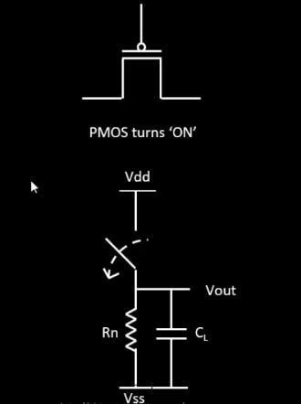</p>

Now, we move to constructing **load curves** for our **PMOS device** that sits at the top of a CMOS inverter.

Connections are like this:

- Source → VDD
- Drain → Output (Vout)
- Gate → Input (Vin)

We define:

- VGSP = VG − VS
- VDSP = VD − VS

But since the source is tied to VDD, we transform our equations so that everything is written in terms of **Vin** and **Vout**.

We use the relation:

**Vout = VDD + VDSP**

That means we’re simply shifting the PMOS curve by +VDD along the X-axis.

Example:

- If VDSP = −2V → Vout = 0V
- If VDSP = 0V → Vout = 2V

So as we move the curve left by VDD, the axis becomes referenced to Vout instead of VDSP.

<p align="center">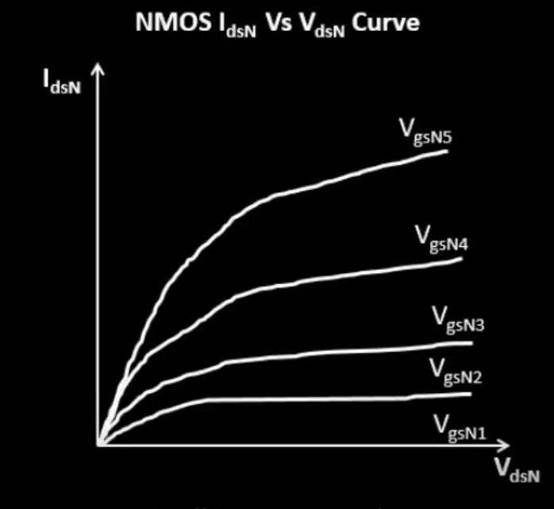</p>

### 🔸 Interpretation

- At **Vout = 0V**, the output capacitor is completely discharged → high charging current flows → finite ID.
- At **Vout = VDD**, the capacitor is fully charged → no current flows → ID = 0.

This PMOS load curve now directly shows how the PMOS sources current to charge the output node.

---

## ⚡ **NMOS Load Curve Derivation**

<p align="center">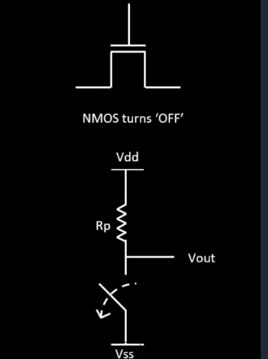</p>

For the NMOS, the connection is simpler:

- Source → Ground (VSS = 0)
- Drain → Output (Vout)
- Gate → Input (Vin)

So:

- VGSN = Vin
- VDSN = Vout

This makes the NMOS load curve **directly dependent** on Vin and Vout, without any axis shifting or translation like PMOS.

<p align="center">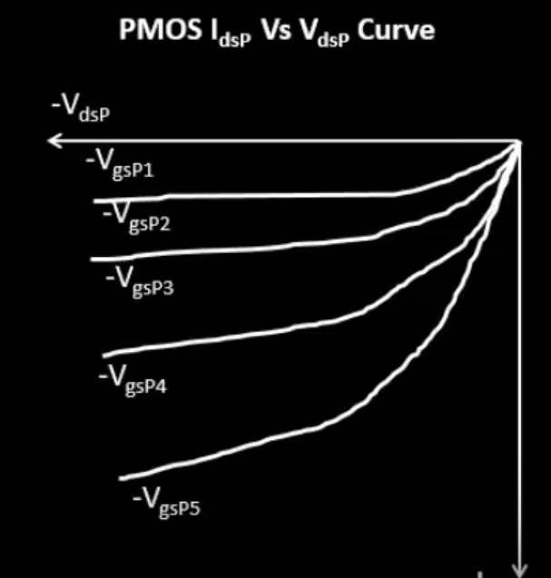</p>

We can directly replace:

- VGSN → Vin
- VDSN → Vout

Hence, drawing NMOS load curves is straightforward — just plot ID vs Vout for different Vin values.

<p align="center"></p>

---

## 🔀 **Combining Load Curves – CMOS Inverter**

Now we take both load curves (for NMOS and PMOS) and **superimpose** them on the same graph with axes (Vin, Vout).

At each Vin value, the **intersection point** of both curves gives the operating point where:

👉 **IDN = IDP**

This intersection defines the output voltage for that input — and plotting these intersection points forms our **VTC (Voltage Transfer Characteristic)** curve of the CMOS inverter.

<p align="center">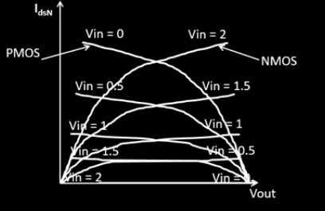</p>

---

## 📉 **Step-by-Step VTC Construction**

Let’s take VDD = 2V and sweep Vin from 0 → 2V.

Below is what happens 👇

| Vin (V) | Vout (V) | PMOS State | NMOS State | Operation |
| --- | --- | --- | --- | --- |
| 0 | ≈2 | Linear | Cutoff | Output HIGH |
| 0.5 | 1.5–2 | Linear | Saturation | Output begins to drop |
| 1.0 | 0.5–1.5 | Saturation | Saturation | **High-gain region** |
| 1.5 | 0–0.5 | Saturation | Linear | Output LOW |
| 2.0 | 0 | Cutoff | Linear | Output pulled fully low |

<p align="center">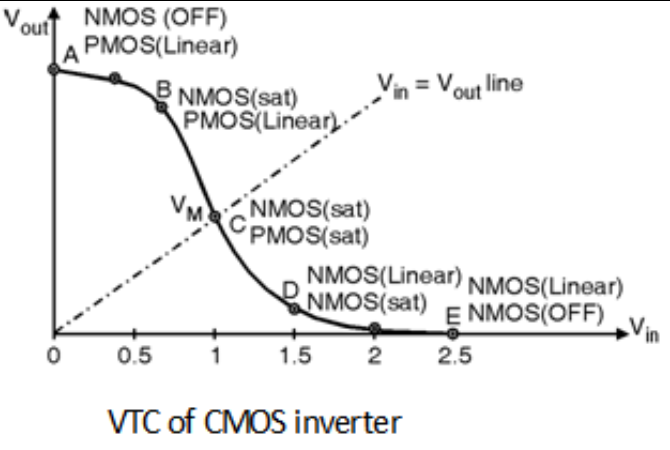</p>

---

### 💡 Key Observations

Vin ↑ ────────────────────────────────→
│
│   High Gain Region
│     (Both Saturation)
│
│ PMOS ON ─────────────── NMOS ON
│ (Linear/Sat)            (Linear/Sat)
│
│      ●    ●     ●
│     ●      ●      ●
│    ●        ●        ●
│───●──────────●──────────●── Vout ↓
2V         1V          0V

- When **Vin = 0**, PMOS is ON (linear), NMOS is OFF → output HIGH (≈ VDD).
- As **Vin increases**, NMOS starts turning ON, PMOS starts turning OFF.
- Around **Vin ≈ 1V**, both are in **saturation** → high gain region (tiny input change → huge output swing).
- Finally, at **Vin = 2V**, PMOS turns OFF completely, NMOS ON strongly → output LOW (≈ 0V).

---

## 🔎 **Analog and Digital View**

- **Digital Operation:**
    
    Works in two stable regions (Vout ≈ 0 or 2V).
    
    Only one device conducts strongly at a time, minimizing static power.
    
- **Analog Operation:**
    
    Utilizes the **transition region** (both in saturation).
    
    High gain (|dVout/dVin| large) → used in amplifiers, analog switches, etc.
    

---

## 🔋 **Capacitor Charging Concept**

When Vout = 0V, the output capacitor is fully discharged → PMOS provides charging current.

When Vout = VDD, capacitor is fully charged → no current flows.

This behavior defines the **charging and discharging current paths** and explains short-circuit currents during switching.

---

## **Velocity Saturation & Scaling Impact**

<p align="center">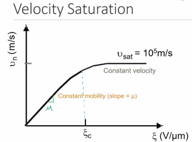</p>

As we move to **lower technology nodes**, electric fields become extremely high even for small VDS.

At this point, **carrier velocity saturates** — it stops increasing linearly with the electric field.

👉 This means the drain current doesn’t increase as fast — it “flattens out” at high fields.

So, the **quadratic relationship** between ID and (VGS − VT) is no longer valid; instead, it becomes **linear in strong velocity saturation**.

This directly affects:

- The slope of load curves.
- The steepness of the VTC.
- The inverter switching speed and gain.

Modern **BSIM SPICE models** automatically include these velocity saturation effects, making SPICE simulation accurate for submicron and nanometer CMOS devices.

---

## 🎯 **Final Takeaways**

✅ PMOS and NMOS load curves are transformed to functions of **Vin** and **Vout**.

✅ Their intersection points form the **VTC curve** of the CMOS inverter.

✅ The **middle transition** region has both transistors in saturation → high gain.

✅ The **two ends** of the VTC correspond to stable logic levels.

✅ Velocity saturation modifies these characteristics in advanced nodes, and SPICE helps validate the behavior precisely.

---


</details>

<details>
<summary><h2> 🌟 LAB </h2> </summary>

### 🧩 Lab: Sky130 ID–VDS & ID–VGS Simulation

**Technology:** Sky130 (Typical Corner)

**W/L:** 0.39 µm / 0.15 µm

**Supply:** VDD = 1.8 V

**a) ID–VDS Sweep**

<p align="center">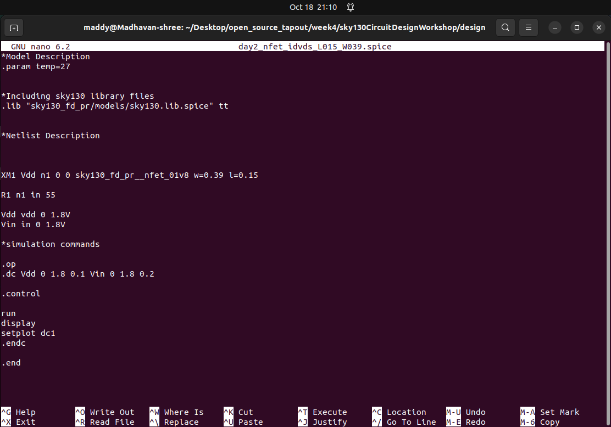</p>

```
ngspice day2_nfet_idvds_L015_W039.spice

ngspice -> plot -vdd#branch
```

<p align="center">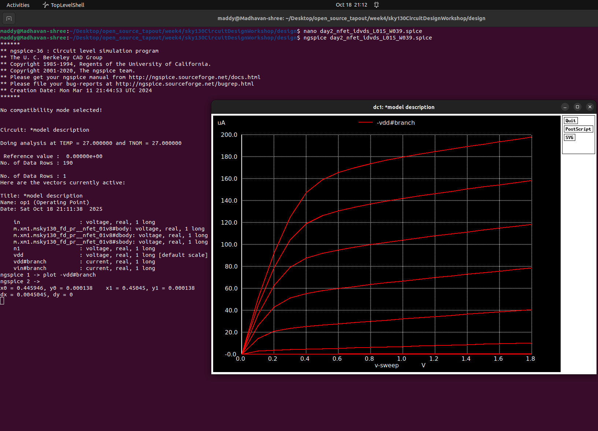</p>

**Result:**

- For small VDS → *Quadratic rise*
- For large VDS (>1 V) → *Linear rise* (velocity saturation visible)
- Peak ID ≈ 196 µA (at VGS = 1.8 V)

**b) ID–VGS Sweep**

<p align="center">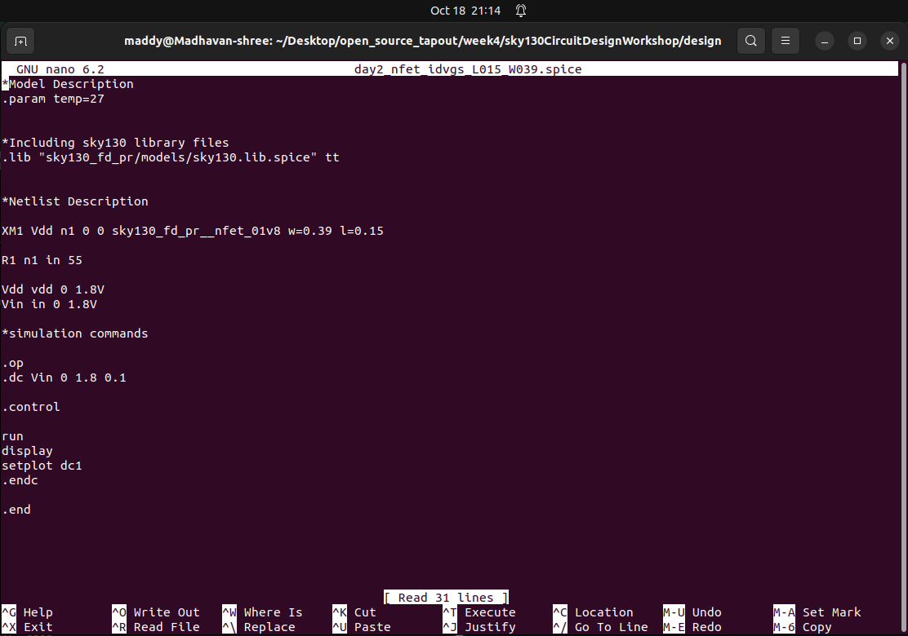</p>

```
ngspice day2_nfet_idvgs_L015_W039.spice

ngspice -> plot -vdd#branch
```

<p align="center">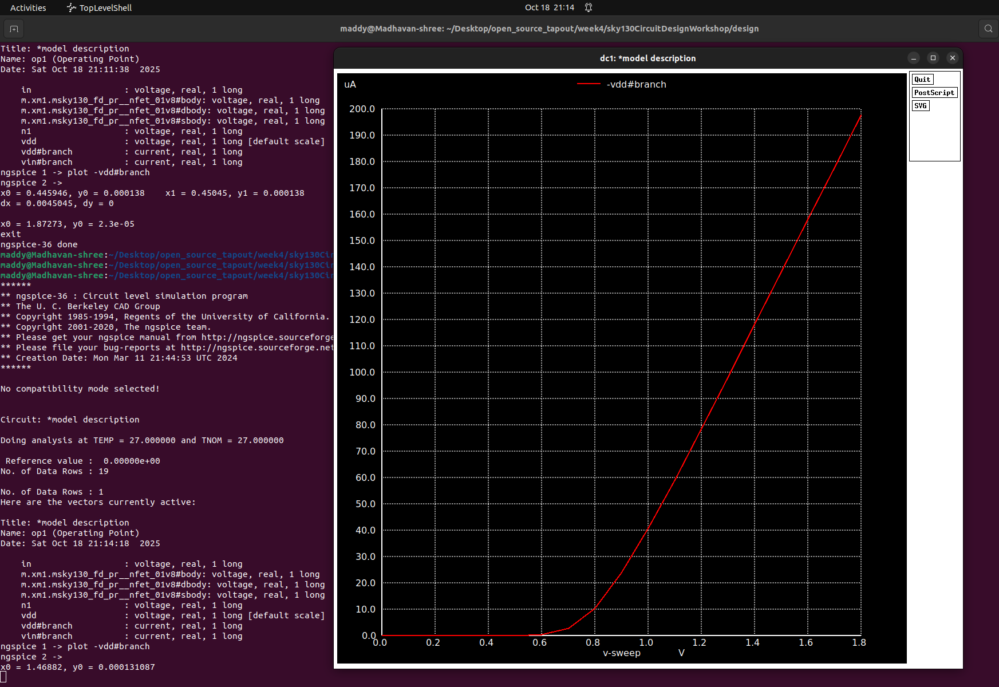</p>

**Result:**

- Short-channel behavior shows linear dependence on VGS at high values.
- Confirms the dominance of velocity saturation.

---

### 🧮 Lab: Threshold Voltage (VT) Extraction

**Objective:** Determine VT from the ID–VGS curve.

**Steps:**

1. Plot ID vs VGS (from L5).
2. Identify the slope region where ID increases rapidly.
3. Draw a **tangent line** at this slope and **extend to X-axis**.
4. Intersection gives the **Threshold Voltage (VT)**.

**Result:**

<p align="center"></p>

VT≈0.77 VV_T ≈ 0.77 \text{ V}

VT≈0.77 V

**Interpretation:**

- VT slightly reduces with channel length scaling due to increased drain-induced barrier lowering (DIBL).

---
</details>
```
