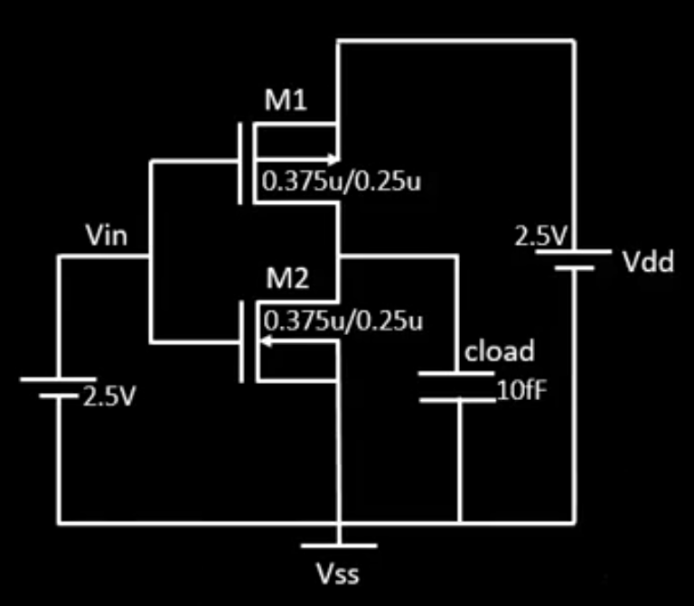
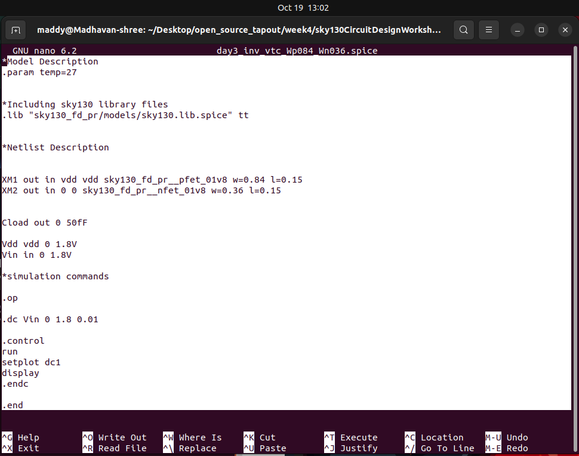
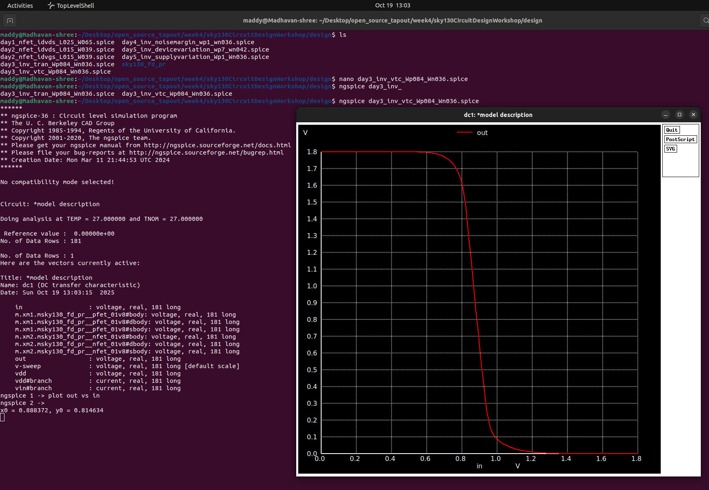
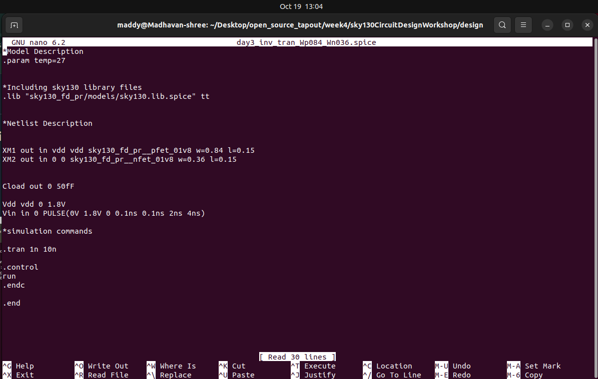

# Week4 DAY2 –**CMOS Switching Threshold & Dynamic Simulation (Ngspice Sky130)**


## 🧩 **Objective Overview**

To explore the **static** and **dynamic characteristics** of a CMOS inverter using **Sky130 open-source PDK** in **Ngspice**, focusing on:

- Voltage Transfer Characteristics (VTC)
- Switching threshold (Vm) determination
- Static & dynamic performance analysis
- Effect of PMOS sizing on symmetry and robustness
- Application in clock and STA domains

---

<details>
<summary><h2> 🌟 THEORY </h2> </summary>

## ⚙️ **THEORY SECTION**

---

### 🧠 1. **Voltage Transfer Characteristics (VTC)**


<p align="center"></p>


- **Definition:** VTC represents the relationship between **input voltage (Vin)** and **output voltage (Vout)** in a CMOS inverter.
- The curve shows three regions:
    1. **Low Vin:** PMOS ON, NMOS OFF → Output = VDD
    2. **Transition Region:** Both MOSFETs partially ON → rapid change in Vout
    3. **High Vin:** PMOS OFF, NMOS ON → Output = 0

🧩 **Purpose:**

- To determine how effectively the inverter switches logic levels.
- To extract the **switching threshold (Vm)** where Vin = Vout.

---

### ⚖️ 2. **Switching Threshold (Vm)**

The switching threshold occurs where **Vin = Vout**, i.e., both transistors conduct equally.

This defines the **point of maximum sensitivity** and **logic symmetry**.

**Typical for Sky130:**

- VDD = 1.8 V
- Vm ≈ 0.87 V (for Wp/Wn ≈ 2.3)

---

### 📐 3. **Analytical Expressions**

### (a) **Vm as a function of (W/L)p and (W/L)n**

Vm=VDD+VTNμn(W/L)nμp(W/L)p−∣VTP∣1+μn(W/L)nμp(W/L)pV_m = \frac{V_{DD} + V_{TN}\sqrt{\frac{\mu_n(W/L)_n}{\mu_p(W/L)_p}} - |V_{TP}|}{1 + \sqrt{\frac{\mu_n(W/L)_n}{\mu_p(W/L)_p}}}

Vm=1+μp(W/L)pμn(W/L)n

VDD+VTNμp(W/L)pμn(W/L)n

−∣VTP∣

Where:

- μn,μp\mu_n, \mu_pμn,μp: Mobilities of NMOS and PMOS
- VTN,VTPV_{TN}, V_{TP}VTN,VTP: Threshold voltages
- (W/L)n,(W/L)p(W/L)_n, (W/L)_p(W/L)n,(W/L)p: Aspect ratios of NMOS and PMOS

---

### (b) **(W/L)p and (W/L)n as a function of Vm**

By rearranging:

(W/L)p(W/L)n=μn(VDD−Vm−VTN)2μp(Vm+VTP)2\frac{(W/L)_p}{(W/L)_n} = \frac{\mu_n(V_{DD} - V_m - V_{TN})^2}{\mu_p(V_m + V_{TP})^2}

(W/L)n(W/L)p=μp(Vm+VTP)2μn(VDD−Vm−VTN)2

🧩 **Interpretation:**

- A **larger (W/L)p** pushes the VTC curve to the right (balanced operation).
- A **smaller (W/L)p** shifts it left (NMOS dominance).

---

### 📊 4. **Static & Dynamic Behavior**

## ⚡ **4.1 Static Behavior**

### 🧠 **Concept Overview**

Static behavior of a CMOS inverter refers to how it behaves under **steady-state DC conditions** — meaning, when the input voltage changes *slowly* or remains constant long enough for all transient effects to settle.

The goal is to study:

- Voltage transfer curve (VTC)
- Switching threshold (Vm)
- Logic levels and noise margins

---

### ⚙️ **4.1.1 Static Transfer Characteristics (VTC)**

When we perform a DC sweep of the inverter input, we get a plot of **Vout vs Vin**.

This curve has three distinct regions:

| Region | NMOS | PMOS | Output | Description |
| --- | --- | --- | --- | --- |
| Region I (Vin ≈ 0 V) | OFF | ON | ≈ VDD | PMOS drives output high |
| Region II (Transition) | ON (linear) | ON (saturation) | Transition | Both transistors conduct → high current |
| Region III (Vin ≈ VDD) | ON | OFF | ≈ 0 V | NMOS drives output low |

---

### 📈 **4.1.2 Switching Threshold (Vm)**

At the **midpoint of the VTC**,

Vin=Vout=VMV_{in} = V_{out} = V_M

Vin=Vout=VM

Both transistors conduct equally (i.e., IDSN=IDSPI_{DSN} = I_{DSP}IDSN=IDSP).

This defines the **switching threshold voltage**, representing the inverter’s balance point.

Analytically derived from current equations:

(W/L)p(W/L)n=μn(VDD−VM−VTN)2μp(VM+VTP)2\frac{(W/L)_p}{(W/L)_n} = \frac{\mu_n(V_{DD} - V_M - V_{TN})^2}{\mu_p(V_M + V_{TP})^2}

(W/L)n(W/L)p=μp(VM+VTP)2μn(VDD−VM−VTN)2

🧩 **Interpretation:**

- If (W/L)p(W/L)_p(W/L)p is increased → inverter becomes more **symmetric**, VMV_MVM shifts **right**.
- If (W/L)p(W/L)_p(W/L)p is decreased → inverter becomes **NMOS dominant**, VMV_MVM shifts **left**.

---

### ⚖️ **4.1.3 Static Power & Noise Margins**

At static equilibrium:

- One transistor is OFF → leakage is minimal → **Static power ≈ 0**.
- The sharp VTC slope ensures strong noise immunity.

**Noise Margins:**

NMH=VOH−VIH,NML=VIL−VOLNM_H = V_{OH} - V_{IH}, \quad NM_L = V_{IL} - V_{OL}

NMH=VOH−VIH,NML=VIL−VOL

A symmetric inverter (Vm ≈ VDD/2) maximizes both.

---

### ⚙️ **Static Behavior Conclusion**

- Ideal logic transfer with near mid-supply Vm.
- Negligible static power dissipation.
- High noise immunity and voltage swing.

---

## ⚡ **4.2. Dynamic Behavior**

---

### 🧠 **Concept Overview**

Dynamic behavior represents how the inverter responds when the **input changes with time** — capturing **transient effects**, **charging/discharging of load capacitance**, and **timing delays**.

The goal is to study:

- Propagation delays
- Rise/Fall times
- Effect of transistor sizing on speed

---

### ⚙️ **4.2.1 Principle**

When the input transitions:

- **High → Low:** PMOS turns ON, output node **charges** through PMOS → defines **rise time (tr)**.
- **Low → High:** NMOS turns ON, output node **discharges** through NMOS → defines **fall time (tf)**.

Both are influenced by:

- Transistor drive current
- Load capacitance (CL)
- Supply voltage (VDD)

---

### ⚙️ **4.2.2 Timing Parameters**

| Parameter | Symbol | Description |
| --- | --- | --- |
| Rise Time | tr | Time for output to rise from 10% → 90% of VDD |
| Fall Time | tf | Time for output to fall from 90% → 10% of VDD |
| Propagation Delay (L→H) | tPLH | Time between input fall (50%) and output rise (50%) |
| Propagation Delay (H→L) | tPHL | Time between input rise (50%) and output fall (50%) |
| Average Delay | tpd | (tPLH + tPHL)/2 |

---

### 🔋 **4.2.3 Role of Capacitance**

Output node capacitance (CL) acts as an **energy storage** element.

Each transition involves charging or discharging CL through MOSFET resistance.

trise/fall∝Req×CLt_{rise/fall} \propto R_{eq} \times C_L

trise/fall∝Req×CL

Hence, increasing PMOS size reduces rise time since Req,p↓R_{eq,p} ↓Req,p↓.

---

### 🧪 **Dynamic Simulation (Transient Analysis)**

**SPICE Input Pulse:**

```bash
Vin in 0 PULSE(0 1.8 0 0.1n 0.1n 2n 4n)
.tran 0.01n 10n
.plot V(in) V(out)

```

**Purpose:**

To observe **input-output timing relationship** and calculate **delays**.

---

### 🧱 5. **Effect of PMOS Width**

When **PMOS width increases**:

- (W/L)p ↑ → stronger PMOS drive
- VTC shifts **rightward** → better balance between logic ‘1’ and ‘0’
- Rise time improves (faster charging)
- Slight increase in overall capacitance

When **PMOS width decreases**:

- VTC shifts **leftward** → NMOS dominates
- Fall time faster, but rise time degraded

---

### 🧭 6. **Applications**

- **Clock Network Design:** CMOS inverters act as clock buffers and level shifters.
- **Static Timing Analysis (STA):**
    - Delay, rise/fall time, and threshold voltage directly influence **setup and hold times**.
    - Essential for **timing closure** in digital IC design.

---

🧮 **Sizing Impact on Vm**

| Case | (Wp/Wn) | Vm | VTC Character |
| --- | --- | --- | --- |
| Balanced | ≈ 2 | ≈ VDD/2 | Symmetrical |
| Narrow PMOS | < 2 | Shifts up | Strong ‘0’, weak ‘1’ |
| Wide PMOS | > 2 | Shifts down | Strong ‘1’, weak ‘0’ |

---

🧩 **Final Insight**

> The CMOS inverter’s switching threshold (Vm) and dynamic delay together define its speed and noise immunity.
> 
> 
> Proper W/L sizing ensures balanced logic transitions, minimal skew, and robust performance — essential for **clock buffer design** and **digital timing analysis** in advanced CMOS technology nodes.


</details>


<details>
<summary><h2> 🌟 LAB </h2> </summary>

### ⚙️ SPICE Deck 1 — CMOS Inverter (DC Sweep for VTC)

👉 follow the commands 
```
nano day3_inv_vtc_Wp084_Wn036.spice

ngspice day3_inv_vtc_Wp084_Wn036.spice

ngspice -> plot out vs in 

```

<p align="center"></p>


```
.param temp=27
.lib "sky130_fd_pr/models/sky130.lib.spice" tt

XM1 out in vdd vdd sky130_fd_pr__pfet_01v8 w=0.84u l=0.15u
XM2 out in 0 0 sky130_fd_pr__nfet_01v8 w=0.36u l=0.15u
Cload out 0 50fF

Vdd vdd 0 1.8
Vin in  0 1.8

.op
.dc Vin 0 1.8 0.01

.control
run
plot v(out) vs v(in)
.endc
.end

```

📉 **Observation:**

- The VTC curve transitions sharply around **0.87 V**, confirming the **switching threshold**.
- For Wp/Wn ≈ 2.3, **Vm ≈ 0.876 V**.

<p align="center"></p>


🧠 **Inference:**

The inverter shows a **clean and sharp switching region**, validating balanced design.


---

### ⚡ **Dynamic Behavior — Transient Simulation**

**Goal:** To understand timing and delay characteristics when the inverter switches with a time-varying input.

```
nano day3_inv_tran_Wp084_Wn036.spice

ngspice day3_tran_vtc_Wp084_Wn036.spice

ngspice -> plot out vs time in 

```


<p align="center"></p>


### ⚙️ SPICE Deck 2 — Transient Analysis

```
.param temp=27
.lib "sky130_fd_pr/models/sky130.lib.spice" tt

XM1 out in vdd vdd sky130_fd_pr__pfet_01v8 w=0.84u l=0.15u
XM2 out in 0 0 sky130_fd_pr__nfet_01v8 w=0.36u l=0.15u
Cload out 0 50fF

Vdd vdd 0 1.8
Vin in 0 PULSE(0 1.8 0 0.1n 0.1n 2n 4n)

.tran 1p 10n
.control
run
plot v(in) v(out)
.endc
.end

```

📈 **Waveform Description:**

- **Vin:** PULSE waveform toggling between 0 V and 1.8 V.
- **Vout:** Inverted response with slight delay and finite rise/fall times.


<p align="center"></p>


---

### ⏱️ **Dynamic Parameters**

| Parameter | Symbol | Description | Typical Value |
| --- | --- | --- | --- |
| Propagation Delay | tpd | Time between 50% transition of Vin and Vout | ~0.33 ns |
| Rise Time | tr | Vout 10% → 90% of VDD | ~0.3–0.4 ns |
| Fall Time | tf | Vout 90% → 10% of VDD | ~0.28 ns |
| Load Capacitance | CL | Affects delay and power | 50 fF |

🧠 **Rise & Fall Delay Calculation (from lab observation)**

- Rise delay ≈ 0.332 ns
- Fall delay ≈ 0.285 ns

🧩 **Key Insights**

| Observation | Interpretation |
| --- | --- |
| Increasing PMOS width | Improves rising speed but increases capacitance (load) |
| Increasing NMOS width | Speeds falling edge, may cause imbalance |
| Balanced βp ≈ βn | Ensures symmetric switching and equal noise margins |
| Transient Simulation | Reveals timing effects unseen in DC analysis |

🖼️ *Image suggestion:*

Place waveform plot of **Vin & Vout vs time**, marking tPHL and tPLH delays.

*(Search: “CMOS inverter transient response timing diagram”)*

---

## 🧩 **Static vs Dynamic Behavior Summary**

| Aspect | Static (VTC) | Dynamic (Transient) |
| --- | --- | --- |
| Purpose | Defines logic transfer characteristics | Evaluates timing and speed |
| Analysis Type | DC sweep | Time-domain simulation |
| Key Output | Vm, gain, noise margins | tpd, tr, tf |
| Influence Factors | W/L ratio, threshold voltage | Capacitance, transistor strength |
| Outcome | Logic behavior understanding | Timing optimization & STA readiness |

---

## 🧠 **Takeaways**

- **Vm ≈ 0.87 V** ensures **balanced inverter switching** for Sky130.
- **Dynamic response** validates real-world propagation delays.
- **Transistor sizing** directly influences symmetry and performance.
- **SPICE** simulations bridge the gap between theory and silicon.


</details>

